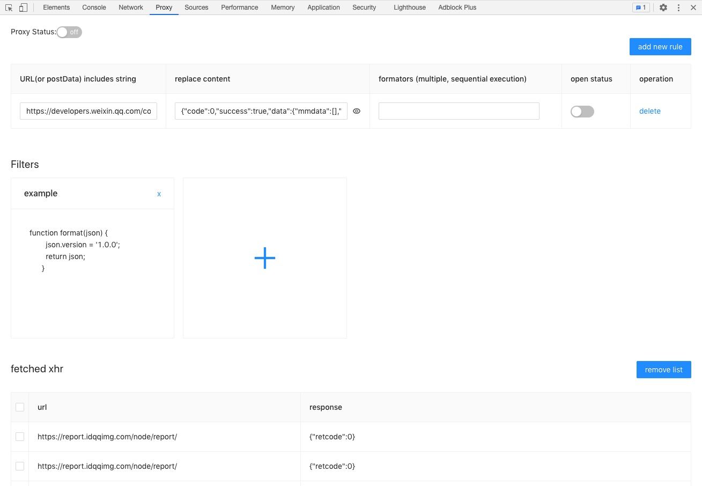

# Ajax Proxy
------------
**Ajax Proxy**是一款支持代理xhr请求chrome扩展，通过url或postData匹配代理接口并配置对应替换内容，同时可自定义过滤器来格式化初始内容生成最终response。

### 使用场景
- 接口数据需要处理再代理, 例如json转xml, xml转json等。
- 根据生产日志复现用户操作场景
- 接口数据很难造
- 外部依赖接口挂了
- ...其他需要代理的场景
### 特性
- 同时支持url匹配字段和postData中匹配字段
- 支持自定义过滤器格式化替换内容，过滤器支持链式调用

### 使用
- chrome依次点击右上角`自定义及控制` -> `更多工具` -> `扩展程序`  或直接搜索框中输入 `chrome://extensions/`
- 开启右上角开发者模式, 加载已解压的扩展程序，选择项目`build`目录
- 在需要代理的页面打开控制台，选择Proxy, 如上图，添加代理规则和过滤器，开启代理状态即可代理接口

### 可能增加功能
- 目前仅代理了xhr请求，后续可放开js，css，图片等资源代理
- json可视化实时编辑
- 其他优化建议等

### 参与贡献
- 提交`Pull Request`改进代码
- 使用并发现问题提交issue或反馈

